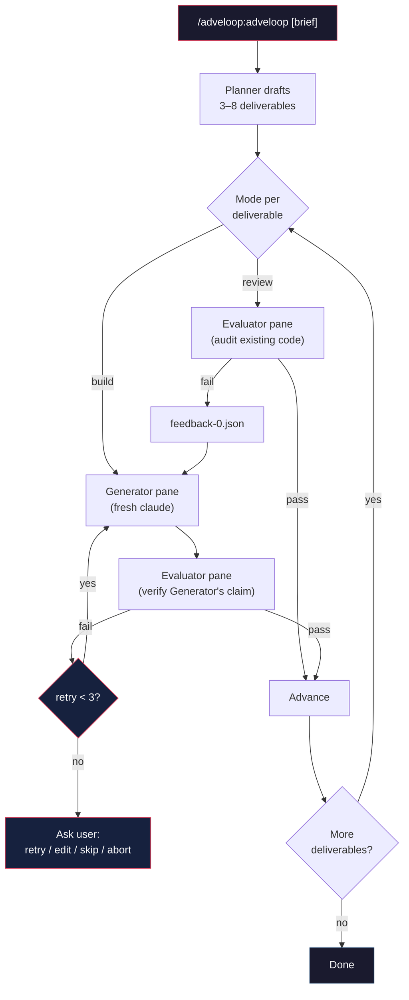

<div align="center">

# adveloop

**GAN-inspired adversarial development loop — Planner directs Generator + Evaluator in fresh cmux panes until the work actually passes**

[](LICENSE)
[]()
[](https://agentskills.io)
[](https://github.com/anthropics/claude-code)
[](https://github.com/manaflow-ai/cmux)
[](https://www.apple.com/macos/)

Ever merged AI-written code that passed every check but was subtly wrong?<br>
That's what happens when the same agent writes and judges its own work.

[Installation](#installation) • [Usage](#usage) • [How It Works](#how-it-works) • [Code Quality](#code-quality-stance) • [Examples](#real-world-scenarios)

</div>

adveloop runs a three-role adversarial loop for every deliverable you approve. A **Planner** (your interactive session) drafts concrete, testable outcomes; a **Generator** in a fresh cmux pane builds or fixes them; an **Evaluator** in another fresh pane exercises the result and returns pass/fail with evidence. Each pane is a new `claude` session — isolated context, skeptical review, hard gate per deliverable. Adapted from Anthropic's [Harness design for long-running agentic apps](https://www.anthropic.com/engineering/harness-design-long-running-apps).

## Installation

<table>
<tr>
  <th width="200">Platform</th>
  <th>How to install</th>
</tr>
<tr>
  <td><strong>Claude Code</strong></td>
  <td><code>claude plugin marketplace add ph3on1x/adveloop</code><br><code>claude plugin install adveloop</code></td>
</tr>
</table>

> [!NOTE]
> Requires [cmux](https://github.com/manaflow-ai/cmux) (macOS 14.0+) and the [`/cmux` skill](https://github.com/ph3on1x/claude-cmux-skill) — adveloop delegates every pane/signal operation to it. The [context7](https://github.com/upstash/context7) MCP server is strongly recommended: both panes are instructed to query current library/framework/API docs through context7 before writing or auditing. Without it, they fall back to training-data knowledge and stale API usage may slip through.

## Usage

```
/adveloop:adveloop [product brief, or path to a spec file; empty to resume]
```

The argument can be an inline brief, a path to a spec file (`.md`, `.txt`, etc.) whose contents become the brief, or empty to resume an existing run.

### When to Use What

<table>
<tr>
  <th width="280">You're thinking...</th>
  <th width="280">Use</th>
  <th>What happens</th>
</tr>
<tr>
  <td>"Build this new feature and actually test it"</td>
  <td><code>/adveloop:adveloop "minimal URL shortener with SQLite"</code></td>
  <td>Planner drafts build-mode deliverables; Generator writes code in a fresh pane; Evaluator exercises each result and returns pass/fail with evidence</td>
</tr>
<tr>
  <td>"Audit this existing code and fix what's broken"</td>
  <td><code>/adveloop:adveloop "review /login for XSS and fix issues found"</code></td>
  <td>Evaluator runs first against your code. If it passes, no Generator runs. If it fails, the verdict becomes the Generator's first feedback round.</td>
</tr>
<tr>
  <td>"I have a longer spec already written up"</td>
  <td><code>/adveloop:adveloop docs/specs/checkout-flow.md</code></td>
  <td>Planner reads the file, drafts deliverables from it, asks you to approve</td>
</tr>
<tr>
  <td>"Pick up where I left off"</td>
  <td><code>/adveloop:adveloop</code></td>
  <td>Reads <code>.adveloop/deliverables.md</code>, reports state per deliverable, offers Resume / Rewrite / Abort</td>
</tr>
</table>

### Modes

<table>
<tr>
  <th width="120">Mode</th>
  <th>Starting point</th>
  <th>Use for</th>
</tr>
<tr>
  <td><strong>build</strong></td>
  <td>Generator runs first, Evaluator verifies</td>
  <td>Greenfield features, new endpoints, new modules</td>
</tr>
<tr>
  <td><strong>review</strong></td>
  <td>Evaluator audits existing code first — Generator only runs if the audit fails</td>
  <td>Audits, hardening passes, bug hunts, fixing existing code</td>
</tr>
</table>

The Planner infers the mode per deliverable from verbs in your brief. When a mode isn't clearly implied, it asks before the approval screen — no silent default. A single run can mix both modes.

## How It Works



Every pane is a fresh `claude --dangerously-skip-permissions` session spawned via cmux. Signals are namespaced with a `run_id` so stale signals from prior runs cannot unblock the current one. Dynamic content (deliverables, feedback) is written to disk first; the pane bootstrap only says "read this file and follow it" — shell injection via backticks or `$(…)` is impossible.

All harness state lives under `.adveloop/` at your project root:

```
.adveloop/
├── deliverables.md            # approved list (Planner's ground truth)
└── tasks/
    └── <N>/
        ├── gen-task.md        # deliverable + prior feedback + signal name
        ├── gen-result.md      # Generator's summary
        ├── eval-task.md       # Generator summary + prior rounds + signal name
        ├── eval-result.json   # {"passed": bool, "evidence": str, "notes": str}
        └── feedback-<R>.json  # Evaluator verdict from failed round R
```

Add `.adveloop/` to your `.gitignore` if you don't want harness metadata tracked — the skill offers to do this on first run.

## Code Quality Stance

Both panes operate under an opinionated quality bar — these are failure conditions for the Evaluator, not stylistic preferences:

- **Native patterns only.** Follow each framework's built-in mechanisms (routing, validation, config, migrations, testing, logging). Do not hand-roll parallels.
- **No hacks, workarounds, or monkey-patches.** No suppressing type errors, lint warnings, or exceptions to make code pass. Fix root causes, not symptoms.
- **Simple, concise, robust.** Less code is better when it's correct.
- **Look it up.** The Generator queries **context7** for library/framework/API docs before writing; the Evaluator cross-checks against current docs while auditing. `WebSearch` and Explore / general-purpose subagents handle other unknowns. Deprecated or incorrect API usage fails the deliverable.

## Real-World Scenarios

### Build a new feature with actual verification

```
> /adveloop:adveloop "minimal URL shortener with SQLite"

Planner drafts 5 build-mode deliverables and shows them for approval.
You approve. For each deliverable:

  Generator pane (fresh session):
    writes routes, schema, tests; runs them; writes a summary.

  Evaluator pane (fresh session):
    curls every endpoint, feeds malformed input, verifies status codes
    match the deliverable, kills the dev server, returns pass/fail JSON.

Fail → feedback loops back to a new Generator round (up to 3).
Pass → advance to the next deliverable.
```

### Audit existing code before shipping

```
> /adveloop:adveloop "review /login for XSS and input validation; fix issues"

Planner drafts a review-mode deliverable.

Evaluator pane runs first against the current code:
  tries <script> payloads, malformed JSON, oversized input;
  returns: passed=false, evidence="Reflected <script> in error page",
           notes="src/auth/login.ts:42 — renders userInput without escaping".

That verdict becomes feedback-0.json.

Generator pane spawns with the verdict as feedback:
  patches the handler, adds tests, re-runs.

Evaluator spawns again, re-exercises, confirms pass — deliverable done.
```

### Resume after a crash

```
> /adveloop:adveloop

Planner reads .adveloop/deliverables.md and scans .adveloop/tasks/:
  1. Persist layer       [build]  — passed
  2. Auth middleware     [build]  — partial (gen-result.md exists, no eval)
  3. Rate limiter        [build]  — pending
  4. Harden /login       [review] — pending

Ask: Resume / Rewrite / Abort.
On Resume, #1 is skipped, #2 jumps straight to the Evaluator,
#3 and #4 run from their mode-appropriate entry points.
```

## Acknowledgments

- **Anthropic** — [Harness design for long-running agentic apps](https://www.anthropic.com/engineering/harness-design-long-running-apps), [Claude Code](https://github.com/anthropics/claude-code), and the [Agent Skills standard](https://agentskills.io)
- **[cmux](https://github.com/manaflow-ai/cmux)** — the native macOS terminal for AI coding agents that makes pane orchestration possible
- **[claude-cmux-skill](https://github.com/ph3on1x/claude-cmux-skill)** — the `/cmux` skill that adveloop delegates every pane operation to
- **GAN research** — the generator/discriminator adversarial framing that inspires the loop's structure

## License

[MIT](LICENSE)
